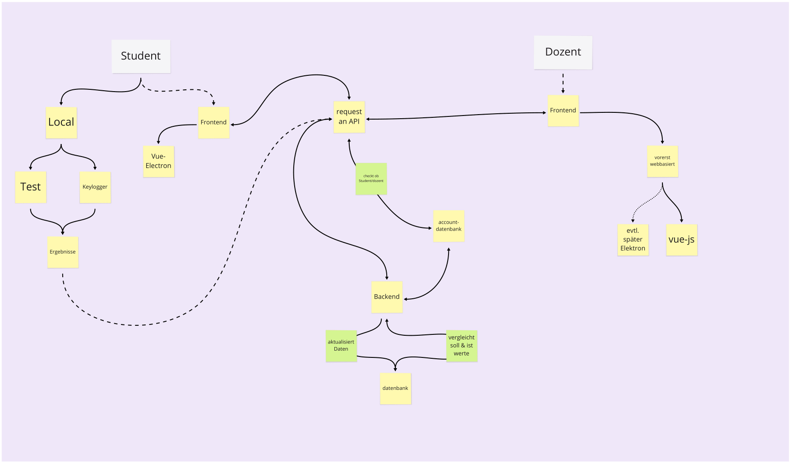

# CONCENTRATION
Dieses Projekt entstand während einem Onlinesemester, als das Coronavirus unser gewohntes Leben stark veränderte. Vorallem der plötzliche Wechsel von Präsenzunterricht zu Onlineunterricht machte vielen Studenten das Leben schwer. Arbeiten und Lernen, statt, wie gewohnt, in dafür geschaffener Umgebung wie Klassenräumen, Hörsäle oder Laboren, nun in heimischer Umgebung. 
Die Konzentration leidet, die Aufmerksamkeit driftet oft unbemerkt schnell von Vorlesung zu etwas anderem ab. Der Student kommt nichtmehr so gut mit, verliert im schlimmsten Fall die Motivation und Lust am Studium.
Hier wollten wir eingreifen. Eine App entwickeln, die bemerkt wann der Nutzer anfängt unaufmerksam zu werden und so helfen soll, die Unterrichtssituation effektiv anzupassen.

## Benutzung
Um die App nutzen zu können, wird man zukünftig einfach die macOS App herunterladen müssen und diese dann wie jeder andere normale App ausführen. Im derzeitigen Status der App muss man zuerst Frontend und Backend von GitHub klonen und dann per npm die Module installieren. Dies setzt vorraus, das Node bereits installiert ist. Wenn das Backend läuft kann man mit `npm run electron:serve` das Frontend starten und die App nutzen.

## Aufbau
Die grundlegende Struktur der App ist wie folgt:  
  
Beim Starten der App öffnet sich das Dashboard. Von dort aus kann der Nutzer die Messung direkt starten, indem er auf den "Messung starten"-Button klickt. Nun zählt ein Timer mit, wie lange die Messung schon läuft. Im derzeitigen Status der App bekommt der Nutzer nun alle 5 bis 15 Minuten einen Ping. Dieser fordert den Nutzer dazu auf, einen kleinen Test zu lösen. Wird der Ping angeklickt, öffnet sich ein weiteres Fenster mit dem besagten Test. Nun wird man darum gebeten, alle Bilder auszuwählen, welche ein entsprechendes Motiv beinhalten. In der derzeitigen Version sind diese Motive: Kuh, Zug, Straße. Werden alle Bilder ausgewählt, öffnet sich ein Popup, welches den Nutzer darauf hinweißt, dass er die Aufgabe erfolgreich gelöst hat und zeigt ihm die Dauer des Tests an. Wird ein Bild ausgewählt, welches nicht mit dem geforderten Motiv übereinstimmt, baut sich die Aufgabe neu auf, die Bilder werden in zufälliger Reihenfolge neu angeordnet und das Thema kann sich ändern. Die Daten aus jedem Test werden an die Datenbank übertragen. Aus besagter Datenbank beziehen nun die Tages- sowie Wochenstatistik ihre Datengrundlagen alle 10 Sekunden. 

## Future Work
Was in zukünftigen Versionen noch seinen Weg in das Projekt finden soll:
* Keylogger, welcher für konstantere Werte sorgt und die Aufmerksamkeitspings schlussendlich auslöst
* Mehr Arten an Aufgaben zum Lösen und Ausbau der "Captcha"
* Verbesserung der Statistik durch den Einbezug von mehr Daten
* Professoren/Dozenten-Ansicht, welche so einen anonymen Durschnittswert ihrer Schüler und Studenten erhalten und so in Echtzeit in das Unterrichtsgeschehen eingreifen können
* Die Möglichkeit, Google Calender und anderweitige Dienste in den Kalender einzubinden
